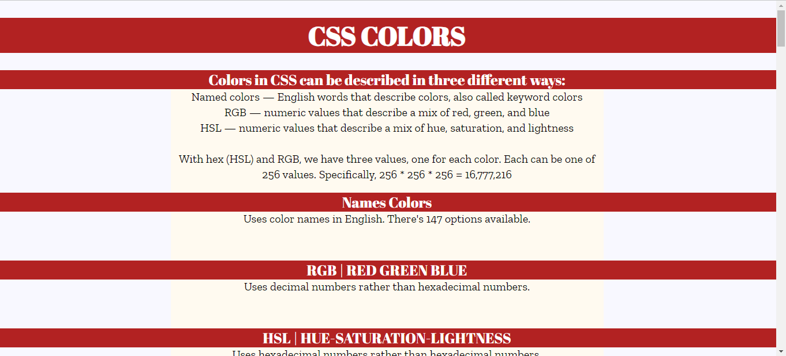
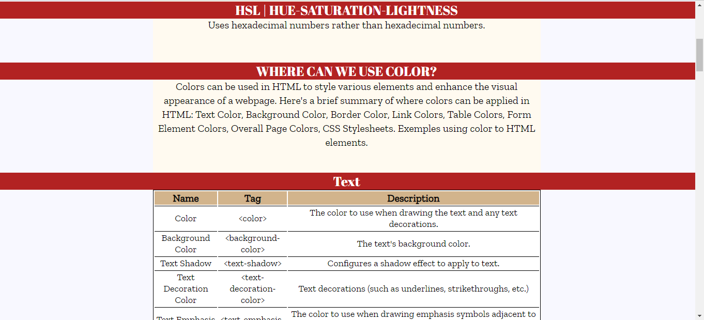
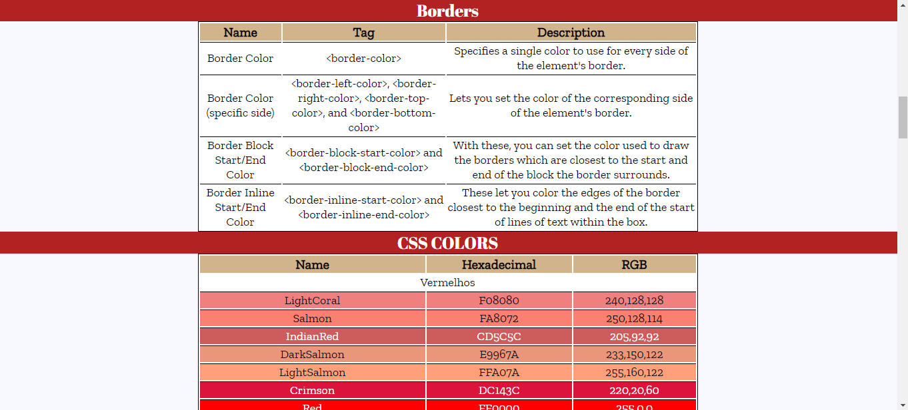
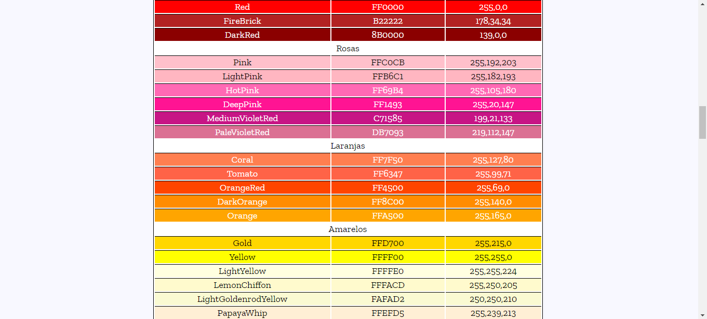
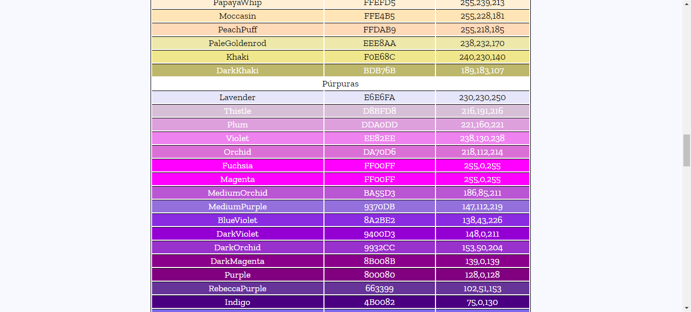

## Cheat Sheet Project

The main goal of this project proposed by Codecademy was to work with tables, HTML tags, CSS properties, and practice some of the knowledge that I've acquired so far. I decided to focus on the "Colors" property because it's an interesting topic for me. Its content is extensive, and I have already worked with some of them.

There are 147 color names in CSS, so I included all these colors in my project along with their respective hexadecimal and RGB values.

## Preview

You can see the project's code here: [Gist | Code](https://gist.github.com/karenlbarcelos/75f2cd602294604541c41e49c607f106)

Layout: 

And so on... til the last color in CSS.